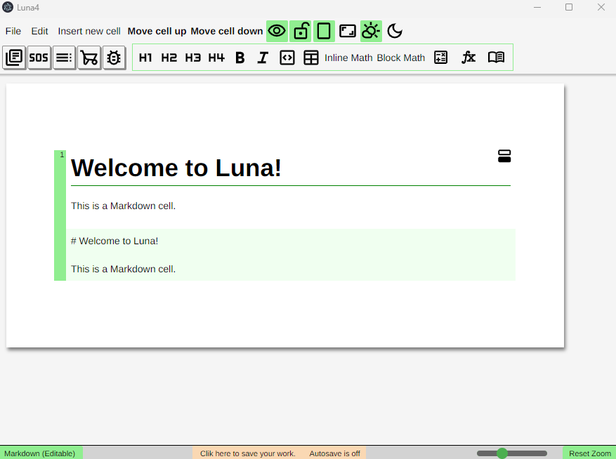
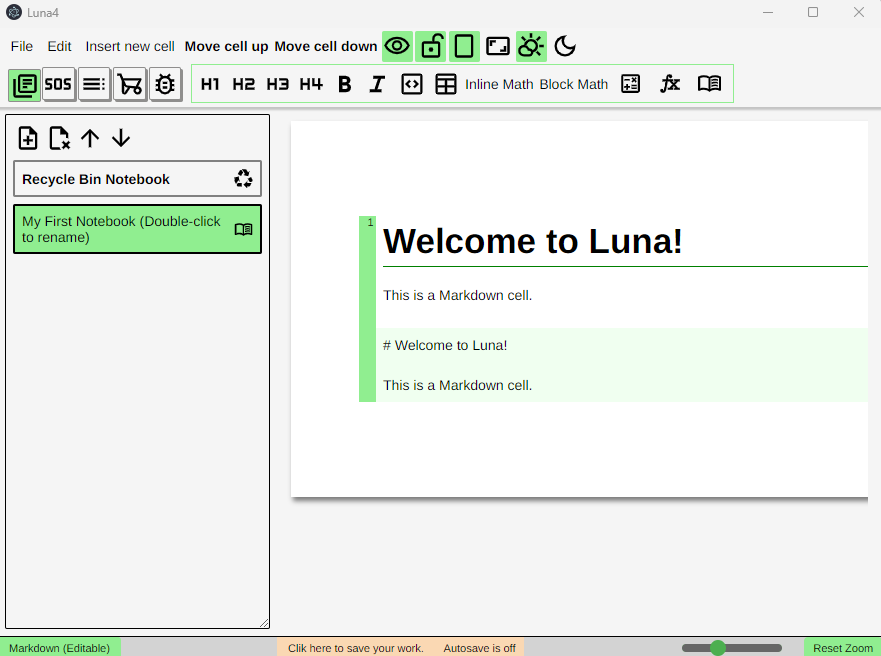
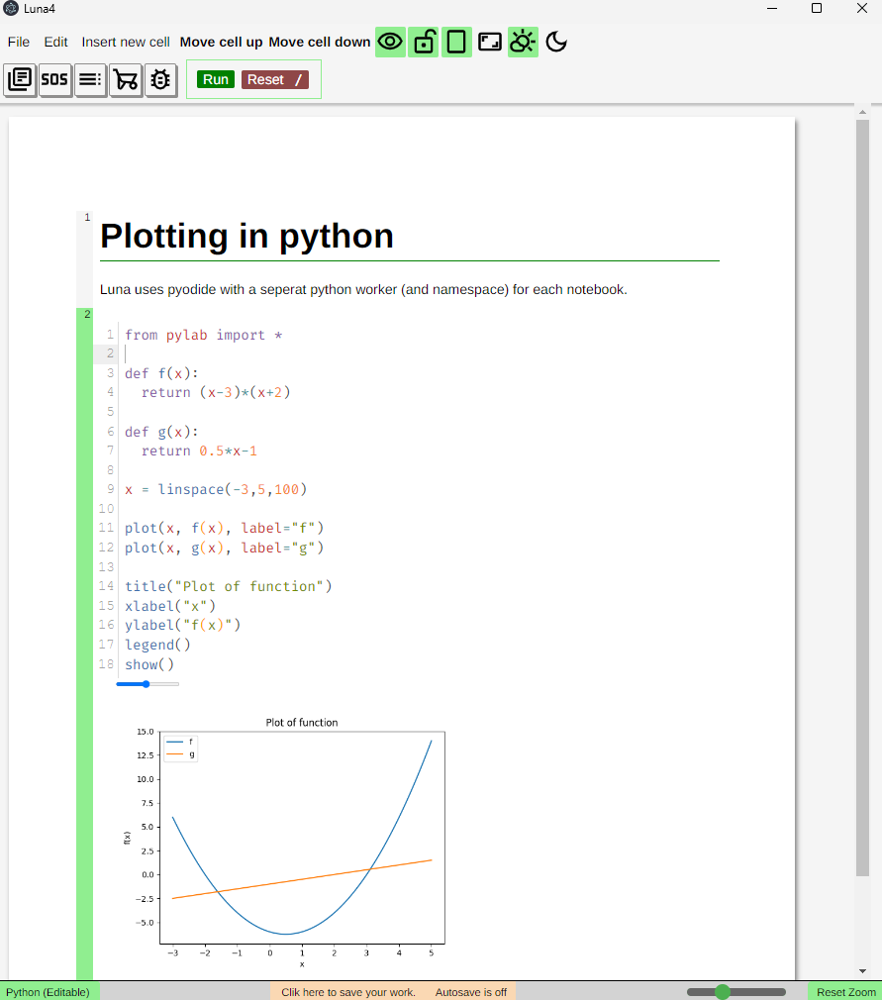
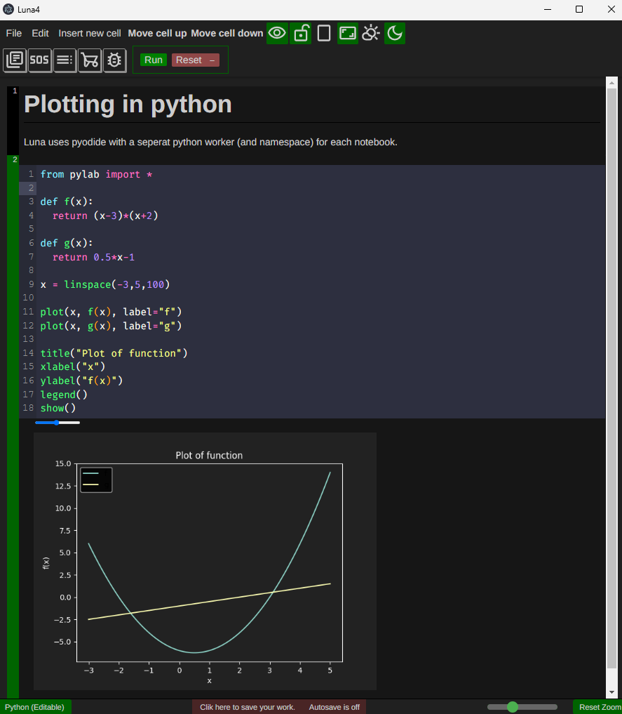

# Luna4

## License

This project is licensed under the [MIT License](LICENSE).

## Importent
⚠️ Important: Luna4 is deprecated, but still functional. It works as a notebook-style Python editor with Markdown support and some Computer Algebra System (CAS) capabilities.
Development is continuing in Luna5, which is being rewritten in TypeScript for improved performance and maintainability.

## Overview
Luna4 is an educational multi-tool application designed to support and streamline workflows for students and teachers. It combines multiple essential tools into a single, unified platform, including:

📝 A Markdown-compatible text editor

🐍 A Python environment powered by Pyodide

➗ CAS (Computer Algebra System) support

📊 A graphical calculator (not implemented)

📐 A geometry explorer (not implemented)

📋 Spreadsheets (not implemented)

🎲 A probability calculator

Luna4 was built with a focus on flexibility and cross-discipline utility, making it suitable for science, math, and general education.

## Screenshots

### Notebook Editor

### Notebook Editor side panel

## Python editor

## Python editor

### CAS Integration

