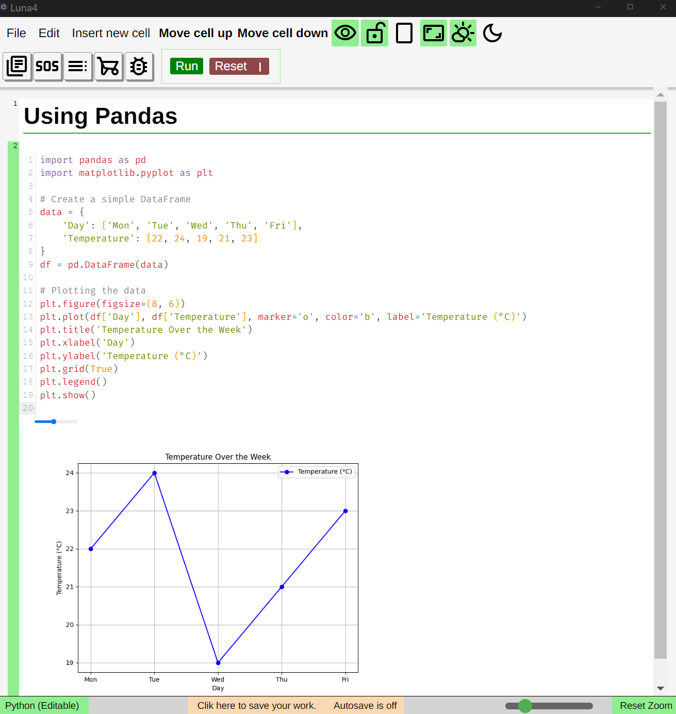

# Luna4
Built using Electron, Vite and VueJS

## ⚠️ Important
Luna4 is deprecated, but still functional. It works as a notebook-style Python editor with Markdown support and some Computer Algebra System (CAS) capabilities. Development is continuing in Luna5, which is being rewritten in TypeScript for improved performance and maintainability.

---

## What is Luna?

Luna4 is an educational multi-tool application designed to support and streamline workflows for both students and teachers.

Modern classrooms often rely on a mix of disconnected tools — students switch between GeoGebra, Python editors, Word, and Excel, while teachers prepare separate files for tests and solutions in Word. This constant **"software jumping"** fragments the learning process and slows down both teaching and studying.

Luna's design philosophy is to **integrate all these tools into one notebook-style application**, where different types of cells (Text editor, Markdown, Python, CAS, Geometry, Graphical Calculator, etc.) work together in a seamless, linear workflow with simple menues.

### For teachers:

* **Create tests and solutions in the same file** using the "hide cell" feature, which allows solution cells to be hidden when exporting the test. This removes the need to maintain two separate documents.
* Use Luna for **live demonstrations**, in-person or over screen sharing, with interactive code and math cells.

### For students:

- Use Luna as an **interactive notebook** that supports Markdown notes, live Python code, symbolic algebra, and more — all in one place.
- Focus more on learning and less complex menues, managing multiple apps or transferring data between them.

It combines multiple essential tools into a single, unified platform, including:

- 📝 A Markdown-compatible text editor
- 🐍 A Python environment powered by Pyodide
- ➗ CAS (Computer Algebra System) support
- 📊 A graphical calculator (not implemented)
- 📐 A geometry explorer (not implemented)
- 📋 Spreadsheets (not implemented)
- 🎲 A probability calculator

Luna4 was built with a focus on flexibility and cross-discipline utility, making it suitable for science, math, and general education.  
One of Luna4’s core design principles is simplicity: it features clean, straightforward menus to support pedagogical clarity and reduce cognitive load for learners.

## License

This project is licensed under the [MIT License](LICENSE).

## Screenshots

### Notebook Markdown Editor

### Notebook Markdown Editor

### Notebook Editor side panel

## Python editor

## Python editor dark mode

### CAS Integration

### Sympy Integration

### Sympy Plotting Integration

### Pandas Integration

### Scipy Integration

### Settings modal

